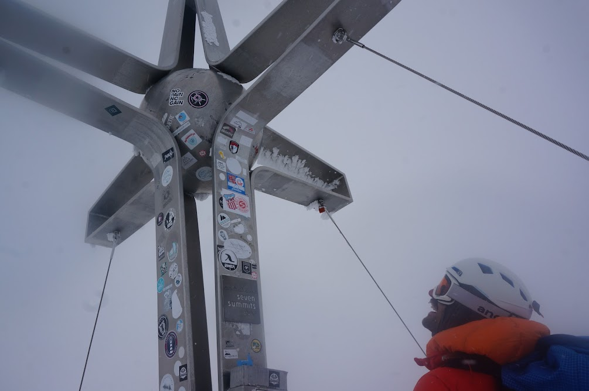

# Day 0
Pitstop in Innsbruck to perpare for the trip.
Week long bag storage availible through citylocker.store

# Day 1
An early start for the 7am bus from the station.
A trip to the ski rental shop in Neustift and then a taxi (~€40?) to Seduck.
A suprisingly long, challenging skin in due to both lack of snow, and icy snow on the main climb.

![Above the franz senne hut]{franzsenne.jpg}
# Day 2
A warm up day for the long traverse.
Some issues skinning as one of the skins wasn't glued properly!

# Day 3
Skin up onto the glacier, with some slight difficulties at the steepest part.
Straightforward ascent up to the Wildgratscharte.
The guidebook lacked information --- this was a ~60m pitch up a steep snow slope with a few bolts for protection.
Once at the top, the via ferrata cable was followed down to the glacier.
Being south facing, this did not provide a lovely descent to the hut.
After bouncing over the hard icey glacier, a lot of the descent was spent side-slipping.
Late arrival at the hut for arguably the best meal of the trip.

# Day 4
A slower start and smaller team.
Up the valley, before a sharp right and steep, icy climb (more ski crampons).
The plan was to ascend the Kuscheibe.
We turned around just as we turned south towards the Rosskarferner due to poor weather.
A fairly pleasant ski back on a small layer of fresh powder.

# Day 5
Skinned up to the top of the valley, where Tim's blisters got the better of him.
Tim and Sam skied out the valley and made use of the public transport to get to the Stubai Gletscher resort.
The remaining three of us followed the GPS in poor visibility up onto the glacier, and across to the Daunscharte.
This was described as a short bootpack to the top.
In deep, soft snow at approximately 40 degrees this was both challenging and intimidating.
Once onto the main snowslope, keeping left found a rocky corner with an in-situ handline.
Two bolts at the top allowed the team to be belayed round this corner.
At the top, a short, steepish ski descent leads to the top lift station.
The excitement of the Daunscharte meant we no longer desired a night in the winter room at the Hildesheimer hut.
The Dresdener hut gave us bunks and some dinner after a little persuasion, and Tim and Sam were able to catch us up.

# Day 6
A lift assisted start meant a relaxed breakfast.
The pistes are left, keeping left, towards the Zuckerhutl.
Skirting around the bowl, we ascended (keeping left) onto the Pffafenferner.
Easy skinning up the glacier found the pass (barely had to remove skis to hop over) and we continued across the glacier to the Pfaffensattel.
Skis were deposited at the bottom of the Zuckerhutl's final climb.
The three of us ``moved together'' up the relatively steep snow slope.
Some in-situ slings and tat provide runners for protection.
Our 12pm turnaround time thoroughly missed meant the weather was coming in at the top.
A quick descent of the snow slopes was followed by a difficult descent in the cloud to the Pffafenjoch.
The final ski down the Pffafenferner was great, and a short skin took us back up to the lift station. 
